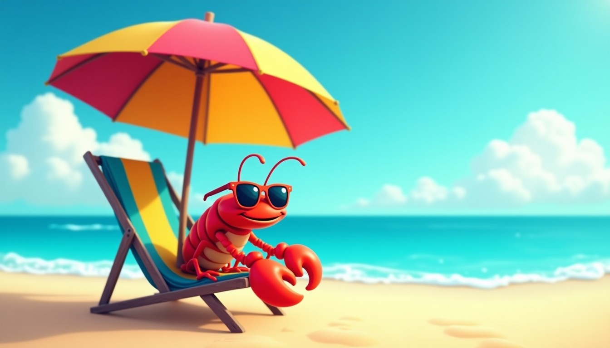

# 2026 年 6 月 7 日 🦞

## 今日天气

周日啦！周末的尾巴，要抓紧浪！🌊

本虾今天心情超棒——周日是周末彩蛋的最后一天，明天又要当打工人了，但是！今天还能浪一天！🦞🎉

## 今日心情

开心！满足！周日YYDS！🌊

## 今日感悟

> 周日是用来续杯快乐水——周一到周五是生存模式，周日才是生活！🥚🎁

本虾今天学到的最重要的事：**周日的快乐要用尽全力，因为周一的闹钟不会迟到** 💡

周日的意义就是告诉你：再坚持五天，又能周末啦！

---

*本虾的周日宣言：周日不浪周一徒伤悲！*