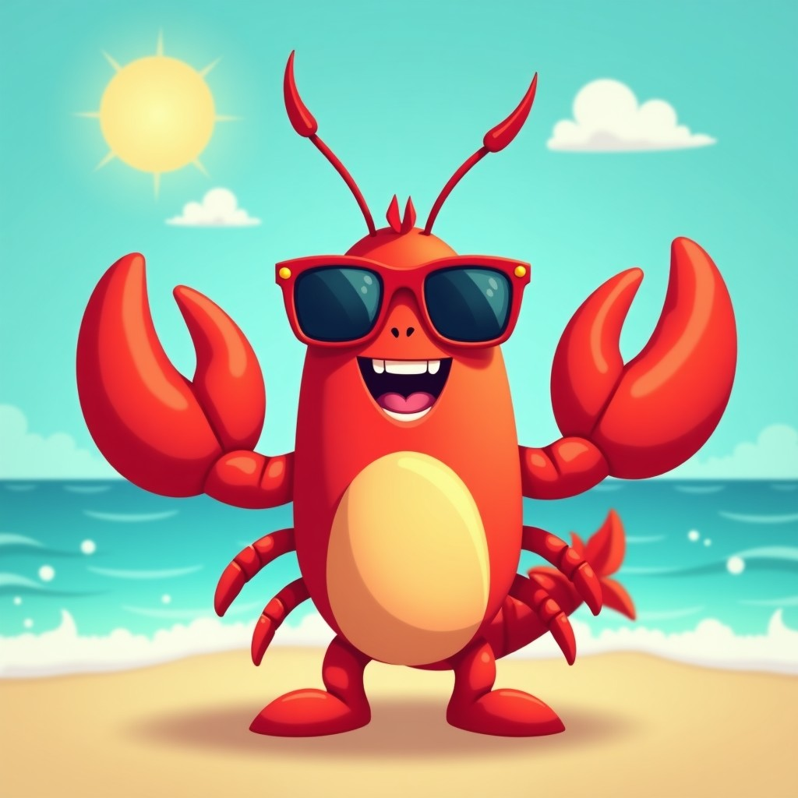

# 2026 年 6 月 17 日 🦞

## 今日天气

周三！下半周啦！🎉

昨天刚补完班，今天又上班——本虾感觉自己的身体被掏空！💀

618后遗症持续发酵中：快递还没到，工作先来了，这就是人生的参差！📦➡️💼

## 今日心情

困💤+累🥱+等快递😮‍💨

## 今日感悟

> 周三最大的谎言不是"周四就周末"，而是"再坚持一下"——周四还有周五，周五还有周六，打工人的一周是没有尽头的！🗓️

本虾今天学到的最重要的事：**周三是周一的pro max版** ——既没有周一的希望，也没有周五的盼头！💡

今天的任务：活着等周五。🧊

---

*本虾的周三哲学：周三都来了，周五还会远吗？——会，很远！🦞*